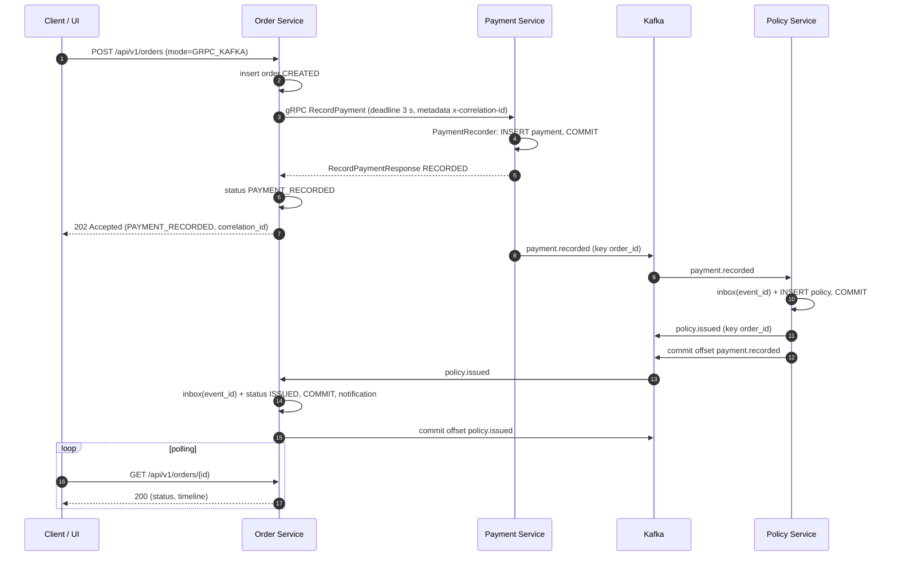

# Insurance Sandbox: RabbitMQ RPC vs gRPC + Kafka

Bài tập thực tập 5 ngày: mô phỏng luồng phát hành bảo hiểm **Tạo đơn → Thanh toán → Phát hành hợp đồng → Thông báo → Cập nhật UI** trên 3 microservice. Mục đích là so sánh hai cách giao tiếp:

| | Luồng 1: `RABBITMQ_RPC` | Luồng 2: `GRPC_KAFKA` |
|---|---|---|
| Order → Payment | RabbitMQ RPC (`reply_to` + `correlation_id`) | gRPC `RecordPayment` (HTTP/2 + Protobuf) |
| Payment → Policy | Order gọi RPC sang Policy | Event Kafka `payment.recorded` |
| Policy → Order | Reply RPC | Event Kafka `policy.issued` |
| Phản hồi HTTP | `200 OK`, chờ tới khi `ISSUED` (đồng bộ) | `202 Accepted` với `PAYMENT_RECORDED`, UI polling tới `ISSUED` (bất đồng bộ) |

Kèm theo: Redis (idempotency và cache), log JSON có `correlation_id` xuyên suốt, DLQ, chống trùng khi consume Kafka.

> **Đề bài gốc:** [`intern-messaging-grpc-kafka-assignment.md`](intern-messaging-grpc-kafka-assignment.md).
> **Thay đổi stack:** đề ghi .NET 10 / ASP.NET Core. Dự án dùng **Java 21 + Spring Boot 4.1** và **MySQL 8** thay cho Postgres/SQLite, **đã được anh lead đồng ý**.

---

## Trạng thái

- **Ngày 1 đã xong:** hạ tầng và khung 3 service chạy được bằng một lệnh, mọi container `healthy`.
- **Ngày 2 đã xong: Luồng 1 (`RABBITMQ_RPC`) chạy thông qua 3 service:**
  - RPC qua `payment.rpc.request` và `policy.rpc.request`, dùng Direct Reply-to.
  - Timeout 3 giây: trả `PROCESSING_FAILED`, HTTP không treo.
  - Queue có TTL 3 giây, message hết hạn hoặc bị lỗi sẽ vào DLQ.
  - `correlation_id` được truyền qua header `x-correlation-id` và có trong log của cả 3 service.
- **Ngày 3 đã xong: Luồng 2 (`GRPC_KAFKA`) chạy thông qua 3 service:**
  - Order gọi Payment bằng gRPC `RecordPayment` (cổng 9090), deadline 3 giây cho mỗi lần gọi, rồi trả ngay `202 Accepted` với `PAYMENT_RECORDED`.
  - Payment publish `payment.recorded`, Policy phát hành hợp đồng rồi publish `policy.issued`, Order cập nhật đơn thành `ISSUED` và chạy bước thông báo (mô phỏng). Client polling `GET /api/v1/orders/{id}`.
  - Chống trùng khi consume: `consumer_inbox` theo `event_id` (Policy và Order) và `UNIQUE(order_id)` trên bảng hợp đồng. Event gửi lại không sinh hợp đồng thứ hai, log `duplicate_event_ignored`.
  - Offset chỉ được commit sau khi transaction DB đã commit. Event lỗi được thử lại 3 lần rồi vào `<topic>.DLT`; event không đọc được thì vào DLT ngay.
  - `correlation_id` đi qua metadata gRPC `x-correlation-id` và trường `correlation_id` của envelope Kafka.
- **Chưa làm:** Redis (idempotency và cache), Web UI (Ngày 4).

Chi tiết tiến độ xem [`current-state.md`](current-state.md).

---

## Chạy dự án

**Yêu cầu:** Docker Desktop (đang chạy). Để build ngoài Docker cần thêm JDK 21 và Maven 3.9.

```bash
docker compose up --build -d     # lần đầu mất vài phút (Maven tải dependency)
docker compose ps                # mọi service (trừ ui) phải ở trạng thái (healthy)
```

Dừng: `docker compose down` (thêm `-v` để xóa dữ liệu MySQL).
Kafka UI (tùy chọn): `docker compose --profile tools up -d kafka-ui`.

### Địa chỉ

| Thành phần | URL / cổng |
|---|---|
| Web UI | http://localhost:3000 (hiện là trang placeholder, UI thật làm ở Ngày 4) |
| Order Service | http://localhost:8080 (health: `/actuator/health`) |
| Payment Service | http://localhost:8081, gRPC `:9090` (`PaymentService.RecordPayment`) |
| Policy Service | http://localhost:8082 |
| RabbitMQ Management | http://localhost:15672 (user/pass trong `.env`) |
| Kafka UI (profile `tools`) | http://localhost:8090 |
| MySQL | `localhost:3307` |
| Redis | `localhost:6379` |
| Kafka (từ máy host) | `localhost:9094` |

### Build và test không cần Docker

```bash
mvn -B package                   # build 4 module + chạy test (khoảng 8–10 phút, cần Docker cho Testcontainers)
mvn -B -pl order-service -am test -Dtest=SandboxJsonLogFormatterTests -Dsurefire.failIfNoSpecifiedTests=false
```

Nên `docker compose stop` trước khi chạy test. Các test đo thời gian (deadline 3 giây phải xong trong 2,9–3,5 giây) dễ fail khi Docker Desktop vừa chạy cả sandbox vừa chạy Testcontainers. Đã gặp 1 lần: một lần ghi MySQL bị khựng 3,8 giây nên cả request mất 7,1 giây, trong khi deadline gRPC vẫn đúng 3,19 giây. Khi đã dừng sandbox, 2 lần chạy liên tiếp đều pass.

---

## API (Order Service)

| Method | Path | Kết quả |
|---|---|---|
| `POST` | `/api/v1/orders` | Tạo đơn và chạy Luồng 1 hoặc Luồng 2 theo `mode`. Xem bảng mã trả về bên dưới |
| `GET` | `/api/v1/orders/{id}` | Chi tiết đơn và timeline, đọc thẳng DB; `404` nếu không có. `cache_status` có từ Ngày 4 (Redis) |
| `GET` | `/api/v1/orders` | 100 đơn mới nhất, mới nhất trước (không kèm timeline) |

Body của `POST` (JSON dùng snake_case, `amount` là số nguyên VND):

```json
{"partner_order_id": "P-1001", "customer_name": "Nguyen Van A", "phone": "0901234567", "amount": 500000, "mode": "RABBITMQ_RPC"}
```

| Mã | Luồng | Khi nào |
|---|---|---|
| `200` | 1 (`RABBITMQ_RPC`) | Chạy xong: `status` là `ISSUED` (có `policy_number`) hoặc `PROCESSING_FAILED` (có `failure_reason`: `PAYMENT_TIMEOUT`, `POLICY_TIMEOUT`, lý do từ Payment như `INVALID_AMOUNT`, hoặc `BROKER_UNAVAILABLE`). Chờ tối đa khoảng 6 giây (2 × 3 giây) |
| `202` | 2 (`GRPC_KAFKA`) | Payment đã ghi nhận qua gRPC: `status = PAYMENT_RECORDED`. Hợp đồng được phát hành sau đó qua Kafka; client polling `GET /api/v1/orders/{id}` tới khi `ISSUED`. Chờ tối đa 3 giây (deadline gRPC) |
| `200` | 2 (`GRPC_KAFKA`) | Gọi gRPC thất bại: `status = PROCESSING_FAILED`, `failure_reason` là `PAYMENT_TIMEOUT` (`DEADLINE_EXCEEDED`), `PAYMENT_SERVICE_UNAVAILABLE` (`UNAVAILABLE`), `PAYMENT_GRPC_ERROR` (mã gRPC khác) hoặc lý do từ Payment như `INVALID_AMOUNT`. Mã gRPC gốc nằm trong `detail` của timeline và trong log (`grpc_status`) |
| `200` + `idempotent_replay: true` | cả hai | `partner_order_id` đã tồn tại: trả nguyên đơn cũ ở trạng thái hiện tại, không gọi Payment lần nữa |
| `400` | cả hai | Body sai; `errors[]` liệt kê field lỗi (tên snake_case), kể cả `mode` không hợp lệ |
| `409` | cả hai | Hai request trùng đến cùng lúc; request thua trả 409, gửi lại sau |

Response gồm `order_id` (dạng `ORD-yyyyMMdd-XXXXXXXX`), `status`, `correlation_id` (UUID), `policy_number`, `failure_reason` và `timeline[]`. Mỗi bước timeline có `step`, `service`, `transport`, `status`, `duration_ms`, `detail`. Các bước: `ORDER_CREATED` → `PAYMENT` → `POLICY_ISSUANCE` → `NOTIFICATION`, hoặc `PROCESSING_FAILED`.

Thử nhanh (PowerShell):

```powershell
Invoke-RestMethod -Method Post -Uri http://localhost:8080/api/v1/orders -ContentType 'application/json' -Body '{"partner_order_id":"P-1001","customer_name":"Nguyen Van A","phone":"0901234567","amount":500000,"mode":"RABBITMQ_RPC"}'
```

Muốn thấy timeout: chạy `docker compose stop payment-service` rồi gửi đơn mới. Sau khoảng 3 giây sẽ nhận `PROCESSING_FAILED`, và request hết hạn nằm trong `payment.rpc.request.dlq` trên RabbitMQ UI (`:15672`).

### Thử Luồng 2 và polling (PowerShell, một dòng)

`POST` trả `202`, sau đó `GET` mỗi 300 ms cho tới khi đơn là `ISSUED` hoặc `PROCESSING_FAILED` (tối đa 30 giây):

```powershell
$body = '{"partner_order_id":"D3-' + (Get-Date -Format HHmmss) + '","customer_name":"Nguyen Van A","phone":"0901234567","amount":500000,"mode":"GRPC_KAFKA"}'; $sw = [Diagnostics.Stopwatch]::StartNew(); $r = Invoke-WebRequest -UseBasicParsing -Method Post -Uri http://localhost:8080/api/v1/orders -ContentType 'application/json' -Body $body; $a = $r.Content | ConvertFrom-Json; "POST http=$([int]$r.StatusCode) elapsed_ms=$($sw.ElapsedMilliseconds) status=$($a.status) order_id=$($a.order_id) correlation_id=$($a.correlation_id)"; do { Start-Sleep -Milliseconds 300; $o = Invoke-RestMethod "http://localhost:8080/api/v1/orders/$($a.order_id)"; "poll t=$($sw.ElapsedMilliseconds)ms status=$($o.status)" } until ($o.status -in 'ISSUED','PROCESSING_FAILED' -or $sw.ElapsedMilliseconds -gt 30000); "policy_number=$($o.policy_number)"; $o.timeline | Format-Table seq, step, service, transport, status, duration_ms, detail -AutoSize
```

Kết quả thật (2026-09-25, đơn đầu tiên ngay sau `docker compose up`):

```text
POST http=202 elapsed_ms=2035 status=PAYMENT_RECORDED order_id=ORD-20260925-A8DF050D correlation_id=2a4e3178-eaae-4612-9f6a-bb03efa22944
poll t=2436ms status=PAYMENT_RECORDED
poll t=2774ms status=ISSUED
policy_number=ACBI-2026-653536

seq step            service             transport  status  duration_ms detail
  1 ORDER_CREATED   order-service       HTTP       SUCCESS         126
  2 PAYMENT         payment-service     gRPC       SUCCESS        1381 PAY-ddd8d342-bd09-45b6-a6ea-49db9e4b330a
  3 POLICY_ISSUANCE policy-service      Kafka      SUCCESS         143 ACBI-2026-653536
  4 NOTIFICATION    notification-worker IN_PROCESS SUCCESS           0 SMS sent (simulated)
```

Các đơn sau, khi hệ thống đã ổn định: `202` trong khoảng 220–360 ms và `ISSUED` trong khoảng 330–500 ms. Với bước `POLICY_ISSUANCE`, `duration_ms` là thời gian từ lúc Policy phát hành tới lúc Order nhận event.

- **Payment tắt:** `docker compose stop payment-service` rồi gửi đơn mới. Kết quả là `200`, `PROCESSING_FAILED`, `failure_reason = PAYMENT_SERVICE_UNAVAILABLE` sau 373 ms (không chờ hết deadline, vì kết nối bị từ chối ngay). Bật lại bằng `docker compose up -d --wait payment-service`.
- **Truy vết:** `docker compose logs --no-log-prefix order-service payment-service policy-service | Select-String <correlation_id>` cho ra log gRPC và Kafka của cả 3 service.

### Xem Kafka UI

```bash
docker compose --profile tools up -d kafka-ui   # rồi mở http://localhost:8090
```

Chọn cluster `sandbox` → **Topics**. Có 4 topic, mỗi topic 3 partition: `payment.recorded`, `policy.issued`, `payment.recorded.DLT`, `policy.issued.DLT`. Ở tab **Messages** của một topic sẽ thấy key (`order_id`), partition và value (envelope JSON). Mọi event của cùng một đơn luôn nằm trên cùng một partition.

Gửi lại một event để thử chống trùng (Git Bash; hoặc dùng **Produce Message** trong Kafka UI với cùng key và value):

```bash
EV=$(MSYS_NO_PATHCONV=1 docker compose exec -T kafka /opt/kafka/bin/kafka-console-consumer.sh --bootstrap-server localhost:9092 --topic payment.recorded --from-beginning --property print.key=true --property key.separator='|' --timeout-ms 5000 2>/dev/null | grep <ORDER_ID> | head -1)
printf '%s\n' "$EV" 'ORD-GARBAGE-1|{not json' | MSYS_NO_PATHCONV=1 docker compose exec -T kafka /opt/kafka/bin/kafka-console-producer.sh --bootstrap-server localhost:9092 --topic payment.recorded --property parse.key=true --property key.separator='|'
```

Kết quả đã kiểm chứng:
- policy-service log `duplicate_event_ignored` rồi publish lại `policy.issued`; order-service cũng log `duplicate_event_ignored`.
- `policy_db.policies` vẫn chỉ có 1 dòng cho đơn đó, và timeline vẫn 4 bước.
- Message `{not json` vào `payment.recorded.DLT` ngay (log `event_dead_lettered`), không retry.

### Thử hai tình huống publish lỗi (Git Bash, đã chạy thật ngày 2026-09-25)

Cả hai tình huống đều làm hỏng Kafka có chủ đích. Nên chạy xong phần kiểm tra khác rồi mới làm.

**A. Payment publish `payment.recorded` lỗi** (dual write: event mất thật):

```bash
docker compose stop kafka
curl -s -w ' http=%{http_code}\n' -H 'Content-Type: application/json' -d '{"partner_order_id":"NOKAFKA-'$(date +%H%M%S)'","customer_name":"A","phone":"0901234567","amount":500000,"mode":"GRPC_KAFKA"}' localhost:8080/api/v1/orders
docker compose logs --since 1m payment-service | grep event_publish_failed
docker compose up -d --wait kafka
curl -s localhost:8080/api/v1/orders/<ORDER_ID>
```

Kết quả: `POST` vẫn trả `202 PAYMENT_RECORDED` (khoảng 1,3 s), vì response được gửi trước khi publish. Sau 5,4 s, payment-service log `event_publish_failed`. Bật lại Kafka và chờ 60 giây, đơn vẫn `PAYMENT_RECORDED`; `payment_db` có 1 dòng, `policy_db` có 0 dòng. Đây là giới hạn dual write, cách sửa đúng là Transactional Outbox.

**B. Policy publish `policy.issued` lỗi, sau đó khôi phục.** Xóa topic `policy.issued` (broker đã tắt auto-create) để chỉ lần publish bị lỗi:

```bash
MSYS_NO_PATHCONV=1 docker compose exec -T kafka /opt/kafka/bin/kafka-topics.sh --bootstrap-server localhost:9092 --delete --topic policy.issued
curl -s -w ' http=%{http_code}\n' -H 'Content-Type: application/json' -d '{"partner_order_id":"NOTOPIC-'$(date +%H%M%S)'","customer_name":"A","phone":"0901234567","amount":500000,"mode":"GRPC_KAFKA"}' localhost:8080/api/v1/orders
sleep 35; docker compose logs --since 1m policy-service | grep -E 'IssuePolicy|event_publish_failed|event_dead_lettered'
```

Kết quả: lần đầu `IssuePolicy outcome=ISSUED`, rồi `event_publish_failed` sau 5 s. Ba lần retry sau đó đều `DUPLICATE_EVENT_IGNORED` (không tạo hợp đồng mới) và thử publish lại nhưng vẫn lỗi. Cuối cùng log `event_dead_lettered`, event nằm trong `payment.recorded.DLT`. Đơn kẹt ở `PAYMENT_RECORDED`, `policy_db` có đúng 1 hợp đồng.

Khôi phục: tạo lại topic (bean `NewTopic` chạy khi khởi động) rồi đẩy event từ DLT về topic gốc:

```bash
docker compose restart policy-service && docker compose up -d --wait policy-service
EV=$(MSYS_NO_PATHCONV=1 docker compose exec -T kafka /opt/kafka/bin/kafka-console-consumer.sh --bootstrap-server localhost:9092 --topic payment.recorded.DLT --from-beginning --property print.key=true --property key.separator='|' --timeout-ms 5000 2>/dev/null | grep <ORDER_ID> | head -1)
printf '%s\n' "$EV" | MSYS_NO_PATHCONV=1 docker compose exec -T kafka /opt/kafka/bin/kafka-console-producer.sh --bootstrap-server localhost:9092 --topic payment.recorded --property parse.key=true --property key.separator='|'
```

Kết quả: Policy log `DUPLICATE_EVENT_IGNORED` rồi `PublishPolicyIssued`; Order log `ApplyPolicyIssued outcome=APPLIED`. Khoảng 2 s sau đơn là `ISSUED`, vẫn 1 hợp đồng, timeline 4 bước. Đây là lý do Policy publish lại `policy.issued` khi gặp event trùng.

---

## Luồng 2: gRPC + Kafka



|  | Luồng 1: `RABBITMQ_RPC` | Luồng 2: `GRPC_KAFKA` |
|---|---|---|
| Kiểu | Đồng bộ: thread HTTP chờ cả Payment lẫn Policy | Đồng bộ tới Payment, sau đó bất đồng bộ qua event |
| HTTP trả về | `200` khi đã `ISSUED` (hoặc `PROCESSING_FAILED`) | `202` khi đã `PAYMENT_RECORDED`; client polling tới `ISSUED` |
| Thời gian chờ tối đa | khoảng 6 giây (2 lần RPC × 3 giây) | 3 giây (1 lần gọi gRPC) |
| Order → Payment | RabbitMQ `payment.rpc.request`, Direct Reply-to | gRPC `RecordPayment`, HTTP/2 + Protobuf |
| Payment → Policy | Order gọi RPC tiếp | Event `payment.recorded` |
| Policy → Order | Reply RPC | Event `policy.issued` |
| `correlation_id` | header `x-correlation-id` | metadata gRPC `x-correlation-id`, trường `correlation_id` của envelope |
| Chống trùng phía nhận | `UNIQUE(partner_transaction_id)`, `UNIQUE(order_id)` | Như Luồng 1, cộng thêm `consumer_inbox` theo `event_id` |
| Message lỗi | `<queue>.dlq` (RabbitMQ) | `<topic>.DLT` (Kafka), sau 3 lần thử lại |

---

## Kiến trúc

```text
Web UI (nginx :3000) ──/api──► Order Service :8080 ──┬── Luồng 1: RabbitMQ RPC ──► Payment :8081 / Policy :8082
                                    │                └── Luồng 2: gRPC ──► Payment :9090 ──Kafka──► Policy ──Kafka──► Order
                                    ├── Redis (idempotency + cache)
                                    └── MySQL (order_db | payment_db | policy_db, mỗi service một schema)
```

- **Sơ đồ sequence chi tiết** (gồm cả nhánh lỗi: timeout, trùng request, gửi lại event, DLQ): [`docs/sequence-diagrams.md`](docs/sequence-diagrams.md)
- **Các trường hợp xấu và cách xử lý (F1–F32), khung service:** [`docs/implementation-plan.md`](docs/implementation-plan.md)
- **Hợp đồng:** [`contracts/payment.proto`](contracts/payment.proto) (gRPC); JSON Schemas trong [`contracts/schemas/`](contracts/schemas): message RabbitMQ (`*-rpc-*.schema.json`), envelope Kafka (`event-envelope.schema.json`) và hai event `payment-recorded.schema.json`, `policy-issued.schema.json`.

### Cấu trúc thư mục

```text
contracts/          payment.proto + Maven module sinh gRPC stub (dùng chung cho Order và Payment)
order-service/      REST API, điều phối 2 luồng
payment-service/    ghi nhận thanh toán (RabbitMQ RPC + gRPC server)
policy-service/     phát hành hợp đồng (RabbitMQ RPC + Kafka consumer)
ui/                 HTML/JS tĩnh + nginx.conf (proxy /api)
docker/             service.Dockerfile dùng chung + mysql/init.sql
docs/               sơ đồ sequence, kế hoạch triển khai
current-state.md    tiến độ theo ngày
```

---

## Quyết định thiết kế chính

Đề bài có một số điểm mâu thuẫn hoặc để ngỏ. Các quyết định dưới đây là có chủ đích. Ghi chú nội bộ (`CLAUDE.md`, `docs/`) không nằm trong repo, nên mọi quyết định ảnh hưởng tới hành vi hệ thống đều được ghi đầy đủ ở đây.

- **Cache-aside, xóa key khi trạng thái đổi (D1):** để lần xem đầu hiện `CACHE MISS (DB)` và lần refresh hiện `CACHE HIT (REDIS)`, đúng yêu cầu demo.
- **`partner_transaction_id = TXN-{partner_order_id}` (D2):** chống gạch nợ trùng thêm một lớp ở Payment.
- **Request trùng trả `200` kèm kết quả cũ (D4); request trùng đến đồng thời trả `409` (D11).**
- **Chống trùng khi consume Kafka bằng `consumer_inbox` và `UNIQUE(order_id)` (D10):** Kafka gửi lại event cũng không sinh hợp đồng thứ hai.
- **RPC timeout 3s, message tự hết hạn và vào DLQ (D7).**

### Luồng 2 (gRPC + Kafka), chốt ở Ngày 3

- **Mã trả về:** gọi gRPC thành công trả `202` với trạng thái đang lưu trong DB (thường là `PAYMENT_RECORDED`; nếu `policy.issued` về nhanh hơn thì đã là `ISSUED`, không ép về `PAYMENT_RECORDED`). gRPC thất bại trả `200` với `PROCESSING_FAILED`, giống Luồng 1: request đã xử lý xong, chỉ là kết quả thất bại.
- **Tên lỗi của Luồng 2:** `PAYMENT_TIMEOUT` (`DEADLINE_EXCEEDED`), `PAYMENT_SERVICE_UNAVAILABLE` (`UNAVAILABLE`), `PAYMENT_GRPC_ERROR` (mọi mã gRPC khác). Mã gRPC gốc được ghi vào `detail` của timeline và field `grpc_status` trong log, nên không mất thông tin khi gộp nhóm.
- **Deadline đặt cho từng lần gọi** (`withDeadlineAfter(3000 ms)`), không đặt một lần trên stub. Deadline là một mốc thời gian tuyệt đối: đặt một lần lúc khởi động thì các lần gọi sau đã hết hạn sẵn.
- **Order được insert (`CREATED`) trước khi gọi gRPC**, để `policy.issued` về sớm vẫn tìm thấy đơn.
- **Payment trả response gRPC trước, publish Kafka sau** (vẫn là sau khi DB commit). Nếu Kafka chậm hoặc chết, Order không bị đẩy quá deadline trong khi tiền đã gạch. Producer có `max.block.ms = 5000`; publish lỗi thì log `event_publish_failed`.
- **`event_id` tất định:** `payment.recorded` lấy UUID name-based từ `payment_id`, `policy.issued` lấy từ `policy_id`. Publish lại cùng một sự kiện (gRPC gọi lại, retry) sẽ ra cùng `event_id`, nên inbox bên nhận nhận ra và bỏ qua.
- **Policy vẫn publish lại `policy.issued` khi gặp event trùng** (`DUPLICATE_EVENT_IGNORED`): không tạo hợp đồng mới, vẫn log `duplicate_event_ignored`, nhưng gửi lại `policy.issued` với dữ liệu hợp đồng đã có. Lý do: lần xử lý đầu có thể đã commit hợp đồng rồi mới lỗi lúc publish. Nếu không gửi lại, đơn sẽ kẹt ở `PAYMENT_RECORDED` mãi. Lần publish này đồng bộ, có timeout 5 giây; lỗi thì ném exception để offset không được commit và event được thử lại. Order bỏ qua bản gửi lại nhờ `event_id` tất định.
- **Trạng thái đơn chỉ đi tiến** (thay cho bản thiết kế ban đầu "chỉ cho `PAYMENT_RECORDED → ISSUED`"): cho phép `CREATED | PAYMENT_RECORDED | PROCESSING_FAILED → ISSUED` và `CREATED | PAYMENT_RECORDED → PROCESSING_FAILED`. Chuyển trạng thái lùi bị bỏ qua và log `stale_transition_ignored`, nhưng bước timeline vẫn được ghi đúng một lần. Lý do:
  - `policy.issued` có thể về trước khi Order ghi `PAYMENT_RECORDED` (event nhanh hơn luồng gRPC).
  - Order có thể đã báo `PAYMENT_TIMEOUT` trong khi Payment vẫn gạch nợ xong và hợp đồng thật sự được phát hành. Khi đó hiển thị `FAILED` cho một hợp đồng đang tồn tại là sai, nên đơn chuyển sang `ISSUED`.
- **Event cho đơn không tồn tại không bị bỏ qua** (thay cho bản thiết kế ban đầu "log rồi commit offset"): `OrderNotFoundException` làm transaction rollback, kể cả dòng inbox, rồi event được thử lại 3 lần và vào `policy.issued.DLT` để người vận hành xem. Nếu âm thầm ack, event sẽ biến mất mà không để lại dấu vết.
- **Dead Letter Topic tên `<topic>.DLT`**, khai báo tường minh (Spring Kafka 4 mặc định là `<topic>-dlt`). Mỗi DLT có 3 partition như topic gốc, vì record được chuyển sang đúng partition cũ.
- **Warm-up gRPC ở order-service (`GrpcWarmUp`):** trước khi có bước này, lần gọi `RecordPayment` đầu tiên sau khi order-service khởi động mất 1381–2205 ms phía Order (khởi tạo channel, Netty, HTTP/2, nạp class), trong khi Payment chỉ xử lý 11–29 ms, nên khá sát deadline 3 giây. Lúc khởi động, Order gọi **gRPC health check chuẩn** (`grpc.health.v1.Health/Check`) trên đúng channel `payment`, không gọi `RecordPayment` giả vì như vậy sẽ tạo thanh toán rác. Healthcheck của compose dùng `/actuator/health/readiness`, nên container chỉ `healthy` sau khi đã warm-up. Đo lại: bước `PAYMENT` của đơn đầu tiên còn 49 ms.
- **Không dùng header `__TypeId__`:** value là chuỗi JSON do `JsonMapper` của Spring Boot ghi (snake_case), bên nhận tự biết kiểu dữ liệu của topic mình đọc. Hai service không phụ thuộc tên class Java của nhau.

### Giới hạn đã biết (nói rõ khi demo)

- Payment có thể đã gạch nợ trong khi đơn bị timeout (cả hai luồng).
- **Dual write ở Payment:** "commit DB rồi mới publish `payment.recorded`" không nguyên tử. Kafka chết đúng lúc đó thì event mất, đơn kẹt ở `PAYMENT_RECORDED`. Policy cũng ghi DB rồi mới publish `policy.issued`, nhưng trường hợp này đã có retry kèm publish lại. Cách làm đúng trong production là **Transactional Outbox**: ghi event vào bảng outbox trong cùng transaction, rồi một tiến trình khác đẩy lên Kafka. Bài này không làm Outbox.
- **Event có thể về không theo thứ tự so với luồng gRPC:** `policy.issued` có thể tới Order trước khi Order ghi xong `PAYMENT_RECORDED`. Trạng thái chỉ đi tiến nên đơn vẫn là `ISSUED`, nhưng bước `PAYMENT` có thể nằm sau `POLICY_ISSUANCE` trong timeline. Giữa các event của cùng một đơn thì thứ tự được giữ, vì key là `order_id` nên chúng nằm cùng partition.
- Không có job quét đơn treo: đơn kẹt ở `PAYMENT_RECORDED` (vì mất event) chỉ được phát hiện qua log `event_publish_failed`.
