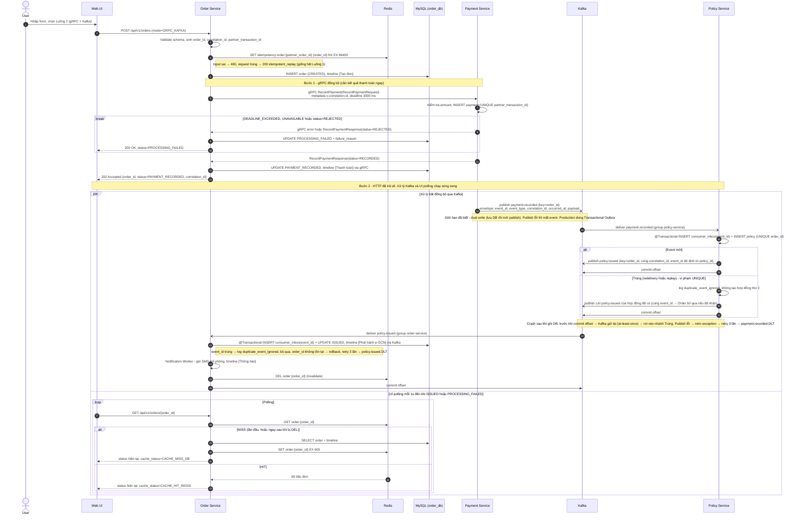

# Sơ đồ Sequence mở rộng

Hai sơ đồ dưới đây mở rộng sơ đồ trong `intern-messaging-grpc-kafka-assignment.md`, bổ sung các nhánh lỗi, cơ chế chống trùng và hành vi cache. Các mã D1–D10 tham chiếu mục 6 "Design Decisions" trong `CLAUDE.md`.

Khối `break` nghĩa là luồng **dừng tại đó** và trả kết quả về ngay.

## Luồng 1: RabbitMQ RPC

```mermaid
sequenceDiagram
    autonumber
    actor User
    participant UI as Web UI
    participant Order as Order Service
    participant Redis
    participant ODB as MySQL (order_db)
    participant Rabbit as RabbitMQ
    participant Pay as Payment Service
    participant Pol as Policy Service

    User->>UI: Nhập form, chọn Luồng 1 (RabbitMQ RPC)
    UI->>Order: POST /api/v1/orders (mode=RABBITMQ_RPC)
    Order->>Order: Validate schema, sinh order_id, correlation_id, partner_transaction_id=TXN-{partner_order_id}

    break Input không hợp lệ (thiếu trường, amount ≤ 0)
        Order-->>UI: 400 Bad Request, không tạo đơn
    end

    Note over Order,Redis: Ngày 2 chưa có Redis: tra partner_order_id trong order_db; hai request đồng thời thì request thua INSERT (UNIQUE) nhận 409 (D11, D12)
    Order->>Redis: SET idempotency:order:{partner_order_id} {order_id} NX EX 86400
    break Key đã tồn tại (request trùng)
        Redis-->>Order: nil, GET key lấy order_id gốc
        Order->>ODB: Đọc đơn gốc
        Order-->>UI: 200 OK, kết quả đơn gốc, idempotent_replay=true
    end
    Redis-->>Order: OK (giữ key thành công)
    Order->>ODB: INSERT order (CREATED), timeline [Tạo đơn]

    Note over Order,Pay: Bước 1 - RPC sang Payment (Order chờ đồng bộ, tối đa 3000 ms)
    Order->>Rabbit: publish payment.rpc.request<br/>reply_to=amq.rabbitmq.reply-to + AMQP correlation_id (RabbitTemplate tự đặt)<br/>header x-correlation-id (correlation_id nghiệp vụ)

    break Timeout 3000 ms (Payment chết, chậm, hoặc message lỗi)
        Order->>Order: convertSendAndReceive trả null → PAYMENT_TIMEOUT, log WARN rpc_timeout
        Order->>ODB: UPDATE PROCESSING_FAILED, timeline [PROCESSING_FAILED] TIMEOUT
        Order->>Redis: DEL order:{order_id}
        Order-->>UI: 200 OK, status=PROCESSING_FAILED (HTTP không bị treo)
        Rabbit->>Rabbit: Message quá x-message-ttl=3000 của queue → sandbox.dlx → payment.rpc.request.dlq
        Note over Order,Rabbit: Nếu Payment trả lời muộn → reply bị bỏ qua, log late_reply_ignored
    end

    Rabbit->>Pay: deliver payment.rpc.request
    Pay->>Pay: Kiểm tra amount, INSERT payment (UNIQUE partner_transaction_id)
    Note right of Pay: Message lỗi (parse/exception) → nack(requeue=false) → DLQ, Order rơi vào nhánh Timeout
    Pay->>Rabbit: reply tới reply_to (cùng correlation_id), status=RECORDED hoặc REJECTED
    Rabbit-->>Order: reply khớp correlation_id

    break status=REJECTED (sai số tiền, hoặc cùng partner_transaction_id nhưng khác nội dung)
        Order->>ODB: UPDATE PROCESSING_FAILED (failure_reason = reject_reason, vd. INVALID_AMOUNT), không gọi Policy
        Order-->>UI: 200 OK, status=PROCESSING_FAILED
    end
    Order->>ODB: UPDATE PAYMENT_RECORDED, timeline [Thanh toán] via RabbitMQ

    Note over Order,Pol: Bước 2 - RPC sang Policy (Order chờ đồng bộ, tối đa 3000 ms)
    Order->>Rabbit: publish policy.rpc.request<br/>reply_to, AMQP correlation_id, header x-correlation-id

    break Timeout 3000 ms
        Order->>ODB: UPDATE PROCESSING_FAILED (POLICY_TIMEOUT)
        Order->>Redis: DEL order:{order_id}
        Order-->>UI: 200 OK, status=PROCESSING_FAILED
        Note over Order,Pay: Giới hạn đã biết - Payment đã gạch nợ nhưng đơn thất bại (cần bù trừ / đối soát, ngoài phạm vi)
    end

    Rabbit->>Pol: deliver policy.rpc.request
    Pol->>Pol: INSERT policy (UNIQUE order_id), sinh policy_id, policy_number ACBI-2026-xxxx
    Note right of Pol: Đã có policy cho order_id → trả lại policy cũ, không tạo mới
    Pol->>Rabbit: reply tới reply_to, status=ISSUED, policy_number
    Rabbit-->>Order: reply khớp correlation_id

    Order->>ODB: UPDATE ISSUED, timeline [POLICY_ISSUANCE]
    Order->>Order: Notification Worker - gửi SMS mô phỏng, timeline [NOTIFICATION]
    Order->>Redis: DEL order:{order_id} (invalidate)
    Order-->>UI: 200 OK {order_id, status=ISSUED, correlation_id, timeline}

    Note over UI,ODB: Xem chi tiết đơn - cache-aside (D1)
    UI->>Order: GET /api/v1/orders/{order_id}
    Order->>Redis: GET order:{order_id}
    alt Lần tải đầu - MISS
        Redis-->>Order: nil
        Order->>ODB: SELECT order + timeline
        Order->>Redis: SET order:{order_id} EX 600
        Order-->>UI: 200 OK, cache_status=CACHE_MISS_DB
    else Refresh - HIT
        Redis-->>Order: dữ liệu đơn
        Order-->>UI: 200 OK, cache_status=CACHE_HIT_REDIS
    end
```

## Luồng 2: gRPC + Kafka


