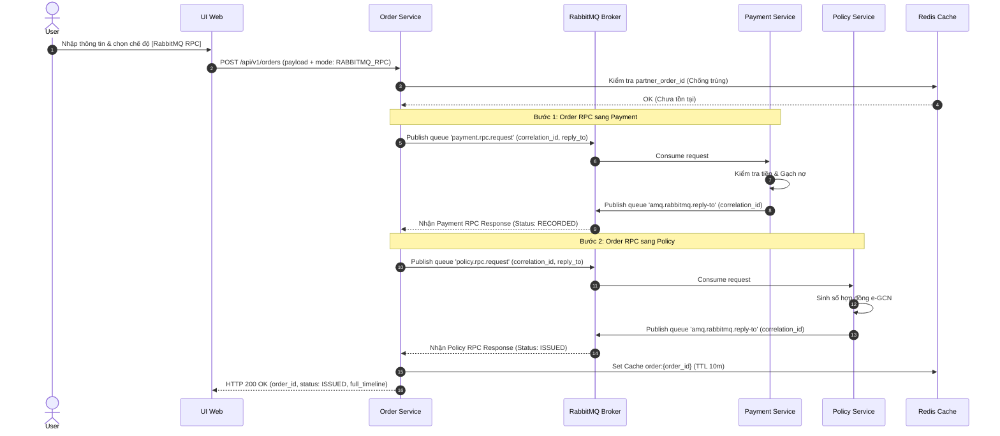
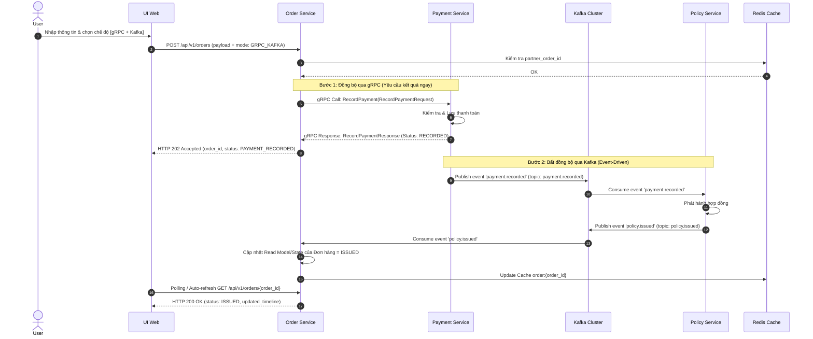

# ĐỀ TÀI THỰC TẬP SINH (5 NGÀY)
## MÔ PHỎNG LUỒNG PHÁT HÀNH BẢO HIỂM ĐA GIAO THỨC (RABBITMQ RPC, KAFKA & GRPC)

* **Tham chiếu kiến trúc gốc:** `SPEC-ACBI-PAP-ARCH-V6.0` (`projects/acb-insurance/acb-insurance-partner-api-platform-architecture.md`)
* **Đối tượng thực hiện:** Thực tập sinh Backend / Fullstack
* **Thời gian thực hiện:** 05 ngày làm việc
* **Mục tiêu chính:** Hiểu rõ và phân biệt được bản chất giữa **giao tiếp đồng bộ dạng request/reply qua RabbitMQ RPC**, **giao tiếp đồng bộ hiệu năng cao qua gRPC** và **kiến trúc event-driven bất đồng bộ qua Kafka**, kết hợp **Redis cache / idempotency** và **observability (log tracing)**.

---

## I. MỤC TIÊU VÀ PHẠM VI BÀI TẬP

### 1. Mục tiêu bài tập
Xây dựng một hệ thống mô phỏng thu nhỏ (Microservice Sandbox) xử lý luồng:
> **Đối tác tạo đơn bảo hiểm → Ghi nhận thanh toán → Phát hành hợp đồng bảo hiểm → Gửi thông báo → Cập nhật UI thời gian thực**

Hệ thống cho phép người dùng chọn 1 trong 2 cơ chế chạy từ UI để so sánh trực quan:
1. **Luồng 1 (RabbitMQ RPC):** 3 microservices giao tiếp request/reply hoàn toàn qua RabbitMQ.
2. **Luồng 2 (gRPC + Kafka):** Order Service gọi Payment Service bằng gRPC đồng bộ (thao tác cần kết quả ngay), sau đó Payment và Policy Service trao đổi sự kiện bất đồng bộ qua Kafka.

### 2. Phạm vi rút gọn
Để bảo đảm hoàn thành chất lượng trong 05 ngày:
* **ĐÃ LƯỢC BỎ (Không làm):** Không làm OAuth2 Server phức tạp, không ký số RSA 2048-bit, không sinh file PDF e-GCN thật lên S3, không gọi SMS/Email thật, không triển khai Kubernetes / PostgreSQL HA.
* **GIỮ LẠI ĐÚNG TRỌNG TÂM:** 3 Microservices core + 1 UI Web + RabbitMQ + Kafka + Redis + Structured JSON Logging với `correlation_id`.

---

## II. KIẾN TRÚC MÔ HÌNH THU NHỎ

### 1. Danh mục 3 Microservices bắt buộc

```text
[UI Web Front-End (React / HTML+JS)]
         │
         ▼ (HTTP REST API)
┌─────────────────────────────────────────────────────────┐
│ 1. Order Service (REST API Controller + Gateway Lite)   │
└──────────────────┬──────────────────┬───────────────────┘
                   │                  │
   (Luồng 1: RabbitMQ RPC)           (Luồng 2: gRPC + Kafka)
                   │                  │
                   ▼                  ▼
┌──────────────────────────┐   ┌──────────────────────────┐
│ 2. Payment Service       │   │ 3. Policy Service        │
└──────────────────────────┘   └──────────────────────────┘
```

#### Service 1: `Order Service` (Dịch vụ Đơn hàng)
* **Trách nhiệm:** 
  * Cung cấp REST API cho UI gọi (Tạo đơn, Lấy danh sách, Lấy chi tiết timeline đơn).
  * Kiểm tra schema dữ liệu đầu vào.
  * Sinh `order_id` và `correlation_id` xuyên suốt luồng.
  * Kiểm tra trùng lặp `partner_order_id` qua Redis.
  * Điều phối Luồng 1 (phát message RabbitMQ RPC tới Payment Service và Policy Service).
  * Điều phối Luồng 2 (gọi gRPC `RecordPayment` tới Payment Service, đồng thời consume Kafka event `policy.issued` để cập nhật trạng thái đơn).

#### Service 2: `Payment Service` (Dịch vụ Thanh toán)
* **Trách nhiệm:**
  * Tiếp nhận yêu cầu thanh toán (kiểm tra số tiền hợp lệ, chống gạch nợ trùng `partner_transaction_id`).
  * **Luồng 1:** Xử lý RabbitMQ RPC Request từ Order Service -> Trả về RPC Response.
  * **Luồng 2:** Cung cấp gRPC Server method `RecordPayment`. Sau khi gRPC ghi nhận thành công, phát sự kiện Kafka `payment.recorded`.
  * Lưu trữ thông tin thanh toán vào DB/In-memory.

#### Service 3: `Policy Service` (Dịch vụ Hợp đồng Bảo hiểm)
* **Trách nhiệm:**
  * Tiếp nhận yêu cầu phát hành hợp đồng sau khi thanh toán thành công.
  * Sinh `policy_id`, `policy_number` mô phỏng.
  * **Luồng 1:** Xử lý RabbitMQ RPC Request từ Order Service -> Trả về RPC Response.
  * **Luồng 2:** Consume Kafka event `payment.recorded` -> Xử lý phát hành hợp đồng -> Phát sự kiện Kafka `policy.issued`.


---

## III. CHI TIẾT 2 LUỒNG GIAO TIẾP MÔ PHỎNG

### 1. LUỒNG 1: GIAO TIẾP NỘI BỘ BẰNG RABBITMQ RPC (3 Services)



**Yêu cầu kỹ thuật bắt buộc cho Luồng RabbitMQ RPC:**
* Phải cấu hình đúng `reply_to` (Direct Reply-to `amq.rabbitmq.reply-to` hoặc temporary reply queue) và `correlation_id`.
* Cấu hình Timeout cho RPC call tại Order Service (Ví dụ: 3000ms). Nếu Payment/Policy Service chập chờn không trả lời, Order Service phải bắt được `TimeoutException`, không treo HTTP Connection của UI và cập nhật trạng thái đơn là `PROCESSING_FAILED`.

---

### 2. LUỒNG 2: GIAO TIẾP BẰNG KAFKA VÀ GRPC (3 Services)



**Yêu cầu kỹ thuật bắt buộc cho Luồng Kafka + gRPC:**
* **gRPC Contract (.proto):** Định nghĩa đúng `PaymentService.proto` với Request/Response đầy đủ kiểu dữ liệu.
* **Kafka Event Contract:** Sử dụng Event Envelope chuẩn gồm `event_id`, `event_type`, `correlation_id`, `occurred_at`, `payload`.
* **Idempotent Consumer tại Policy Service & Order Service:** Phải kiểm tra `event_id` hoặc `order_id` trong `consumer_inbox` (hoặc Redis/DB). Nếu Kafka gửi lại trùng message, consumer **không được sinh thêm Hợp đồng thứ 2** mà phải log `duplicate_event_ignored`.

---

## IV. YÊU CẦU UI DEMO & NGHIỆM THU

Giao diện Web UI (đơn giản, dễ sử dụng) để thực tập sinh biểu diễn trực tiếp luồng chạy khi anh/chị nghiệm thu:

### 1. Form Tạo Đơn Bảo Hiểm
* Các trường input: Mã đơn đối tác (`partner_order_id`), Tên khách hàng, Số điện thoại, Số tiền thanh toán.
* **Radio Button chọn chế độ chạy:**
  * `[ ] Luồng 1: RabbitMQ RPC`
  * `[ ] Luồng 2: gRPC + Kafka`
* Nút **[Tạo Đơn & Phát Hành]**.

### 2. Màn Hình Trực Quan Luồng Chạy (Real-time Timeline)
Hiển thị danh sách các bước đã chạy của đơn hàng dưới dạng Timeline/Stepper:
1. **[Tạo đơn]** -> Order Service -> *Success* (`duration: 12ms`)
2. **[Thanh toán]** -> Payment Service (Via gRPC / RabbitMQ) -> *Success* (`duration: 45ms`)
3. **[Phát hành e-GCN]** -> Policy Service (Via Kafka / RabbitMQ) -> *Success* (`policy_number: ACBI-2026-8899`)
4. **[Thông báo]** -> Notification Worker -> *Success* (SMS Sent)

### 3. Thông tin Observability & Cache trên UI
* Hiển thị mã `Correlation ID` của luồng.
* Hiển thị nhãn **`Cache Status: CACHE MISS (DB)`** (ở lần load đầu) và **`Cache Status: CACHE HIT (REDIS)`** (khi refresh lại trang).
* Nút **[Gửi lại Request trùng]** để test tính năng Chống ghi nhận trùng (Idempotency).

---

## V. CÁC TÍNH NĂNG KỸ THUẬT NỀN TẢNG (LOG, CACHE, RESILIENCE)

### 1. Redis Cache & Idempotency
* **Idempotency Key:** Kiểm tra `idempotency:order:{partner_order_id}` trên Redis với TTL 24h. Trả về kết quả cũ nếu trùng request.
* **Read Cache:** Cấu hình Cache key `order:{order_id}` trên Redis với TTL 10 phút. API `GET /api/v1/orders/{id}` phải ưu tiên đọc từ Redis trước khi truy vấn DB.

### 2. Observability & Structured JSON Logging
Tất cả 3 services phải in log ra `stdout` chuẩn định dạng JSON, có truyền nhận `correlation_id` xuyên suốt:

```json
{
  "timestamp": "2026-09-23T09:15:00.123Z",
  "service": "payment-service",
  "log_level": "INFO",
  "correlation_id": "corr-uuid-9988-7766",
  "transport": "gRPC",
  "action": "RecordPayment",
  "order_id": "ORD-20260923-001",
  "status": "SUCCESS",
  "execution_time_ms": 35,
  "cache_hit": false
}
```

---

## VI. LỊCH TRÌNH THỰC HIỆN 05 NGÀY

| Ngày | Mục tiêu công việc chi tiết | Sản phẩm đạt được |
| :--- | :--- | :--- |
| **Ngày 1** | - Đọc hiểu đặc tả & vẽ sơ đồ Sequence Luồng 1 & Luồng 2.<br>- Khởi tạo Repo, setup Docker Compose (RabbitMQ, Kafka, Redis, Postgres/SQLite).<br>- Dựng Khung 3 Microservices .NET 10 / ASP.NET Core. | Docker Compose up thành công các hạ tầng; 3 services khởi động và healthcheck OK. |
| **Ngày 2** | - Cấu hình RabbitMQ Broker.<br>- Implement **Luồng 1 (RabbitMQ RPC)** qua 3 services.<br>- Cấu hình `reply_to`, `correlation_id` và Timeout 3s. | Test Postman/Swagger luồng RabbitMQ RPC chạy thông 3 services. |
| **Ngày 3** | - Định nghĩa `payment.proto`, build gRPC client/server.<br>- Cấu hình Kafka Producer/Consumer.<br>- Implement **Luồng 2 (gRPC + Kafka)** qua 3 services.<br>- Xử lý Idempotent Consumer cho Kafka. | Test Postman/Swagger luồng gRPC + Kafka phát hành hợp đồng thành công. |
| **Ngày 4** | - Dựng Web UI (ReactJS hoặc HTML/JS đơn giản) kết nối API Order Service.<br>- Tích hợp Redis Cache (Cache Hit/Miss) & Idempotency Check.<br>- Chuẩn hóa Structured JSON Log có `correlation_id`. | Mở Web UI tạo đơn, hiển thị Timeline, Log và Cache Hit/Miss hoạt động mượt mà. |
| **Ngày 5** | - Test các kịch bản ngoại lệ (Timeout, Duplicate Request, Dead Letter Queue).<br>- Viết file `README.md` hướng dẫn chạy 1-Click (`docker compose up`).<br>- **Báo cáo & Demo nghiệm thu với Anh/Lead.** | Báo cáo bài tập, chạy demo UI trực tiếp và trả lời các câu hỏi giải thích cơ chế. |

---

## VII. BỘ CÂU HỎI NGHIỆM THU

Khi nghiệm thu, thực tập sinh phải trình bày và hỏi sau**:

1. **Khác biệt cốt lõi:** Tại sao Luồng 1 dùng RabbitMQ RPC lại là *Đồng bộ (Synchronous Wait)* dù truyền qua Message Broker? Khác gì với Luồng 2 dùng Kafka Event *Bất đồng bộ (Asynchronous)*?
2. **Cơ chế RPC:** Trong RabbitMQ RPC, thuộc tính `reply_to` và `correlation_id` đóng vai trò gì? Nếu Payment Service xử lý mất 10s thì Order Service sẽ bị ảnh hưởng thế nào?
3. **gRPC vs REST:** Tại sao ở Luồng 2, Order Service lại gọi Payment Service bằng gRPC thay vì HTTP REST? Ưu điểm của HTTP/2 và Protobuf là gì?
4. **Kafka Idempotency:** Trong Kafka, nếu Consumer bị sập ngay sau khi xử lý xong DB nhưng chưa kịp Commit Offset, khi khởi động lại Kafka sẽ gửi lại Event đó (`At-least-once`). Làm sao em đảm bảo Policy Service không tạo trùng 2 Hợp đồng?
5. **Caching & Tracing:** Em đã triển khai Redis Cache ở bước nào? Làm thế nào để truy vết một Request bị lỗi từ UI đi qua 3 Services dựa trên Log?

---

## VIII. CÁCH THỨC ĐÓNG GÓI BÀI NỘP

Thực tập sinh bàn giao Git Repository chứa:
1. `docker-compose.yml`: Khởi động toàn bộ UI, 3 Services, RabbitMQ, Kafka, Redis chỉ bằng **1 lệnh duy nhất** (`docker compose up --build`).
2. `README.md`: Hướng dẫn các bước chạy, danh mục API, ảnh chụp màn hình UI và sơ đồ kiến trúc luồng.
3. `contracts/`: Chứa file `.proto` (gRPC) và JSON Schemas (Kafka events / RabbitMQ messages).

